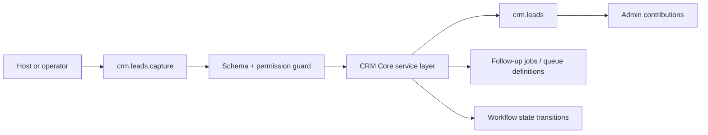
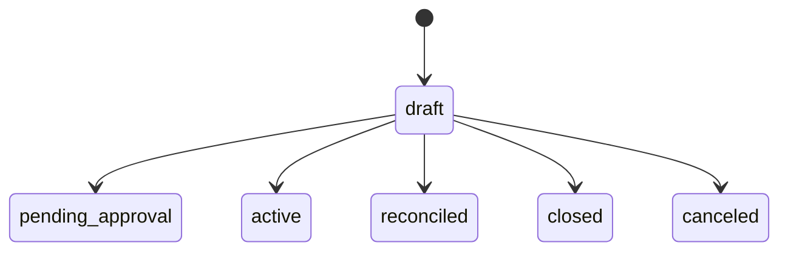

# CRM Core Developer Guide

Lead, opportunity, campaign, and pre-sales engagement records with governed handoff readiness before sales takes commercial truth ownership.

**Maturity Tier:** `Hardened`

## Purpose And Architecture Role

Owns lead, opportunity, and pre-sales readiness state so commercial handoff stays explicit before Sales becomes the demand source of truth.

### This plugin is the right fit when

- You need **lead intake**, **opportunity state**, **handoff readiness** as a governed domain boundary.
- You want to integrate through declared actions, resources, jobs, workflows, and UI surfaces instead of implicit side effects.
- You need the host application to keep plugin boundaries honest through manifest capabilities, permissions, and verification lanes.

### This plugin is intentionally not

- Not a full vertical application suite; this plugin only owns the domain slice exported in this repo.
- Not a replacement for explicit orchestration in jobs/workflows when multi-step automation is required.

## Repo Map

| Path | Purpose |
| --- | --- |
| `package.json` | Root extracted-repo manifest, workspace wiring, and repo-level script entrypoints. |
| `framework/builtin-plugins/crm-core` | Nested publishable plugin package. |
| `framework/builtin-plugins/crm-core/src` | Runtime source, actions, resources, services, and UI exports. |
| `framework/builtin-plugins/crm-core/tests` | Unit, contract, integration, and migration coverage where present. |
| `framework/builtin-plugins/crm-core/docs` | Internal domain-doc source set kept in sync with this guide. |
| `framework/builtin-plugins/crm-core/db/schema.ts` | Database schema contract when durable state is owned. |
| `framework/builtin-plugins/crm-core/src/postgres.ts` | SQL migration and rollback helpers when exported. |

## Manifest Contract

| Field | Value |
| --- | --- |
| Package Name | `@plugins/crm-core` |
| Manifest ID | `crm-core` |
| Display Name | CRM Core |
| Domain Group | Operational Data |
| Default Category | Business / CRM & Pipeline |
| Version | `0.1.0` |
| Kind | `plugin` |
| Trust Tier | `first-party` |
| Review Tier | `R1` |
| Isolation Profile | `same-process-trusted` |
| Framework Compatibility | ^0.1.0 |
| Runtime Compatibility | bun>=1.3.12 |
| Database Compatibility | postgres, sqlite |

## Dependency Graph And Capability Requests

| Field | Value |
| --- | --- |
| Depends On | `auth-core`, `org-tenant-core`, `role-policy-core`, `audit-core`, `workflow-core`, `party-relationships-core` |
| Recommended Plugins | `sales-core` |
| Capability Enhancing | `support-service-core`, `ai-assist-core`, `analytics-bi-core` |
| Integration Only | `business-portals-core` |
| Suggested Packs | `sector-ecommerce`, `sector-education`, `sector-financial-services-compliance`, `sector-healthcare`, `sector-nonprofit`, `sector-professional-services`, `sector-retail`, `sector-trading-distribution` |
| Standalone Supported | Yes |
| Requested Capabilities | `ui.register.admin`, `api.rest.mount`, `data.write.crm`, `events.publish.crm` |
| Provides Capabilities | `crm.leads`, `crm.opportunities`, `crm.forecasts` |
| Owns Data | `crm.leads`, `crm.opportunities`, `crm.activities`, `crm.forecasts` |

### Dependency interpretation

- Direct plugin dependencies describe package-level coupling that must already be present in the host graph.
- Requested capabilities tell the host what platform services or sibling plugins this package expects to find.
- Provided capabilities and owned data tell integrators what this package is authoritative for.

## Public Integration Surfaces

| Type | ID / Symbol | Access / Mode | Notes |
| --- | --- | --- | --- |
| Action | `crm.leads.capture` | Permission: `crm.leads.write` | Capture CRM Lead<br>Idempotent<br>Audited |
| Action | `crm.opportunities.advance` | Permission: `crm.opportunities.write` | Advance Opportunity<br>Non-idempotent<br>Audited |
| Action | `crm.handoffs.prepare` | Permission: `crm.opportunities.write` | Prepare Sales Handoff<br>Non-idempotent<br>Audited |
| Action | `crm.leads.hold` | Permission: `crm.leads.write` | Place Record On Hold<br>Non-idempotent<br>Audited |
| Action | `crm.leads.release` | Permission: `crm.leads.write` | Release Record Hold<br>Non-idempotent<br>Audited |
| Action | `crm.leads.amend` | Permission: `crm.leads.write` | Amend Record<br>Non-idempotent<br>Audited |
| Action | `crm.leads.reverse` | Permission: `crm.leads.write` | Reverse Record<br>Non-idempotent<br>Audited |
| Resource | `crm.leads` | Portal disabled | Lead records with routing, qualification, and dedupe-ready state.<br>Purpose: Keep pre-sales intake governed before a commercial commitment exists.<br>Admin auto-CRUD enabled<br>Fields: `title`, `recordState`, `approvalState`, `postingState`, `fulfillmentState`, `updatedAt` |
| Resource | `crm.opportunities` | Portal disabled | Opportunities, stages, and pre-sales commercial context.<br>Purpose: Track demand readiness before Sales becomes the commercial source of truth.<br>Admin auto-CRUD enabled<br>Fields: `label`, `status`, `requestedAction`, `updatedAt` |
| Resource | `crm.forecasts` | Portal disabled | Forecast and handoff-readiness views derived from active pipeline state.<br>Purpose: Give operators and leadership a stable pre-sales projection surface.<br>Admin auto-CRUD enabled<br>Fields: `severity`, `status`, `reasonCode`, `updatedAt` |

### Job Catalog

| Job | Queue | Retry | Timeout |
| --- | --- | --- | --- |
| `crm.projections.refresh` | `crm-projections` | Retry policy not declared | No timeout declared |
| `crm.reconciliation.run` | `crm-reconciliation` | Retry policy not declared | No timeout declared |


### Workflow Catalog

| Workflow | Actors | States | Purpose |
| --- | --- | --- | --- |
| `crm-opportunity-lifecycle` | `sales-rep`, `manager`, `revops` | `draft`, `pending_approval`, `active`, `reconciled`, `closed`, `canceled` | Keep lead-to-opportunity and handoff state explicit before quote or order creation. |


### UI Surface Summary

| Surface | Present | Notes |
| --- | --- | --- |
| UI Surface | Yes | A bounded UI surface export is present. |
| Admin Contributions | Yes | Additional admin workspace contributions are exported. |
| Zone/Canvas Extension | No | No dedicated zone extension export. |

## Hooks, Events, And Orchestration

This plugin should be integrated through **explicit commands/actions, resources, jobs, workflows, and the surrounding Gutu event runtime**. It must **not** be documented as a generic WordPress-style hook system unless such a hook API is explicitly exported.

- No standalone plugin-owned lifecycle event feed is exported today.
- Job surface: `crm.projections.refresh`, `crm.reconciliation.run`.
- Workflow surface: `crm-opportunity-lifecycle`.
- Recommended composition pattern: invoke actions, read resources, then let the surrounding Gutu command/event/job runtime handle downstream automation.

## Storage, Schema, And Migration Notes

- Database compatibility: `postgres`, `sqlite`
- Schema file: `framework/builtin-plugins/crm-core/db/schema.ts`
- SQL helper file: `framework/builtin-plugins/crm-core/src/postgres.ts`
- Migration lane present: Yes

The plugin ships explicit SQL helper exports. Use those helpers as the truth source for database migration or rollback expectations.

## Failure Modes And Recovery

- Action inputs can fail schema validation or permission evaluation before any durable mutation happens.
- If downstream automation is needed, the host must add it explicitly instead of assuming this plugin emits jobs.
- There is no separate lifecycle-event feed to rely on today; do not build one implicitly from internal details.
- Schema regressions are expected to show up in the migration lane and should block shipment.

## Mermaid Flows

### Primary Lifecycle



### Workflow State Machine




## Integration Recipes

### 1. Host wiring

```ts
import { manifest, captureCrmLeadAction, BusinessPrimaryResource, jobDefinitions, workflowDefinitions, adminContributions, uiSurface } from "@plugins/crm-core";

export const pluginSurface = {
  manifest,
  captureCrmLeadAction,
  BusinessPrimaryResource,
  jobDefinitions,
  workflowDefinitions,
  adminContributions,
  uiSurface
};
```

Use this pattern when your host needs to register the plugin’s declared exports without reaching into internal file paths.

### 2. Action-first orchestration

```ts
import { manifest, captureCrmLeadAction } from "@plugins/crm-core";

console.log("plugin", manifest.id);
console.log("action", captureCrmLeadAction.id);
```

- Prefer action IDs as the stable integration boundary.
- Respect the declared permission, idempotency, and audit metadata instead of bypassing the service layer.
- Treat resource IDs as the read-model boundary for downstream consumers.

### 3. Cross-plugin composition

- Register the workflow definitions with the host runtime instead of re-encoding state transitions outside the plugin.
- Drive follow-up automation from explicit workflow transitions and resource reads.
- Pair workflow decisions with notifications or jobs in the outer orchestration layer when humans must be kept in the loop.

## Test Matrix

| Lane | Present | Evidence |
| --- | --- | --- |
| Build | Yes | `bun run build` |
| Typecheck | Yes | `bun run typecheck` |
| Lint | Yes | `bun run lint` |
| Test | Yes | `bun run test` |
| Unit | Yes | 1 file(s) |
| Contracts | Yes | 1 file(s) |
| Integration | Yes | 1 file(s) |
| Migrations | Yes | 2 file(s) |

### Verification commands

- `bun run build`
- `bun run typecheck`
- `bun run lint`
- `bun run test`
- `bun run test:contracts`
- `bun run test:unit`
- `bun run test:integration`
- `bun run test:migrations`
- `bun run docs:check`

## Current Truth And Recommended Next

### Current truth

- Exports 7 governed actions: `crm.leads.capture`, `crm.opportunities.advance`, `crm.handoffs.prepare`, `crm.leads.hold`, `crm.leads.release`, `crm.leads.amend`, `crm.leads.reverse`.
- Owns 3 resource contracts: `crm.leads`, `crm.opportunities`, `crm.forecasts`.
- Publishes 2 job definitions with explicit queue and retry policy metadata.
- Publishes 1 workflow definition with state-machine descriptions and mandatory steps.
- Adds richer admin workspace contributions on top of the base UI surface.
- Ships explicit SQL migration or rollback helpers alongside the domain model.
- Documents 6 owned entity surface(s): `Lead`, `Opportunity`, `Prospect`, `Campaign`, `Stage History`, `Forecast Snapshot`.
- Carries 4 report surface(s) and 3 exception queue(s) for operator parity and reconciliation visibility.
- Tracks ERPNext reference parity against module(s): `CRM`.
- Operational scenario matrix includes `lead-capture`, `qualification-and-scoring`, `opportunity-handoff-to-sales`.
- Governs 2 settings or policy surface(s) for operator control and rollout safety.

### Current gaps

- No extra gaps were discovered beyond the plugin’s declared boundaries.

### Recommended next

- Deepen scoring, routing, and handoff validation before more quote creation depends on CRM quality.
- Add stronger campaign and activity evidence where pre-sales governance becomes operationally significant.
- Broaden lifecycle coverage with deeper orchestration, reconciliation, and operator tooling where the business flow requires it.
- Add more explicit domain events or follow-up job surfaces when downstream systems need tighter coupling.
- Convert more ERP parity references into first-class runtime handlers where needed, starting from `Lead`, `Opportunity`, `Prospect`.

### Later / optional

- Outbound connectors, richer analytics, or portal-facing experiences once the core domain contracts harden.
